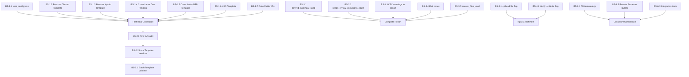

# Career Brain — Phase 5 Build Specifications

> **Methodology:** Outcome-Driven Development × Spec-Driven Development × Sequential Thinking  
> **Scope:** Phase 5 Google Workspace Integration (generate_document.py and supporting system)  
> **Last Updated:** 2026-05-27

---

## Executive Summary

The Career Brain Phase 5 engine (`generate_document.py` + `content_engine.py`) is functionally complete at the Python layer — it correctly selects, scores, and injects content from the 3-pillar JSON engines into Google Doc templates via the Workspace API. The remaining work is concentrated in three areas: (1) the **Golden Master Google Doc templates do not exist yet** — without real template Doc IDs, Phase 5 cannot generate a single real document; (2) several **report fields required by the spec are missing**, creating an audit gap; and (3) a small number of **constraint enhancements** (Australian terminology enforcement, Rosetta Stone on resume bullets) are deferred and unimplemented. This document defines all remaining work as atomic, testable build specs grouped into six milestones.

---

## Milestone 0 — Foundation (DONE ✓)

> Record only. Do not re-implement.

| Component | Status |
|---|---|
| Phases 1–4 ETL pipeline (normalise → compile → curate → inject) | ✓ Done |
| `generate_document.py` v2 (clone + inject + postflight scan) | ✓ Done |
| `content_engine.py` (role/bullet/narrative/skill selection with keyword scoring) | ✓ Done |
| v2 Placeholder schema (resume, cover_letter, ksc — full multi-section) | ✓ Done |
| Google Workspace API integration (OAuth + service account + Drive clone) | ✓ Done |
| `doc_templates.json` schema (template + variant + Drive folder config) | ✓ Done (IDs empty) |
| `tests/test_generate_document.py` (unit tests for core logic) | ✓ Done |
| `agent_skills/ats_template_qa_v3/SKILL.md` (ATS linting skill scaffold) | ✓ Done |
| Rosetta Stone translation protocol (apply_rosetta_stone, generate_bridge_paragraph) | ✓ Done |
| Dry-run mode (`--dry-run`) | ✓ Done |
| Redacted generation report (`doc_generation_report.json`) | ✓ Done (partial fields) |

---

## Gap Table — What Is Not Done

| # | Gap | Blocks |
|---|---|---|
| G1 | `user_config.json` does not exist (contact, education, certs) | All real generation |
| G2 | Golden Master Google Docs do not exist (5 templates needed) | All real API calls |
| G3 | Drive subfolder IDs not configured | Drive folder placement |
| G4 | ATS QA skill not exercised against real template IDs | Template quality assurance |
| G5 | `derived_summary_used` flag missing from report | Audit trail completeness |
| G6 | `needs_review_exclusions_count` missing from report | Data quality visibility |
| G7 | KSC word count warnings not written to report (only logged) | KSC quality gate |
| G8 | Exit code semantics undefined | Operational shell scripting |
| G9 | `source_files_used` missing from report | Source lineage audit |
| G10 | `--job-ad` file flag not implemented | Job-ad keyword extraction from file |
| G11 | Batch template validation command not implemented | ATS QA at scale |
| G12 | Australian terminology not systematically enforced in generated text | C4 constraint |
| G13 | Rosetta Stone not applied to resume bullets (only cover letter bridge) | C5 constraint |
| G14 | Integration tests (dry-run mode, all 3 doc types) not written | Regression confidence |

---

## Milestone 1 — Configuration Layer

> **Goal:** Enable the first real document generation end-to-end.  
> **Critical path.** Nothing else works until these are done.

### BS-1.1 — Create `user_config.json`

**What:** Populate `user_config.json` (from `user_config.example.json`) with real values:
- `contact.name`, `contact.phone`, `contact.email`, `contact.location`
- `education[]` — list of qualification strings (degree, institution, year)
- `certifications[]` — list of certification strings (cert name, issuer, year)

**Why:** All v2 resume and cover letter placeholder builders require contact info. Without it, `{{CONTACT_NAME}}` and siblings remain empty and the document fails postflight validation.

**Acceptance Criterion:**
```
python3 tools/generate_document.py --type resume --target "Test" --dry-run
```
Exits `0`. Dry-run output shows `CONTACT_NAME` is non-empty.

---

### BS-1.2 — Create Golden Master: Resume Chronological

**What:** Create a new Google Doc with the following structure (ATS-compliant):
- **Section order:** Contact Block → Professional Summary → Core Skills → Work History (chronological) → Education & Certifications
- **Placeholders:** `{{CONTACT_NAME}}`, `{{CONTACT_PHONE}}`, `{{CONTACT_EMAIL}}`, `{{CONTACT_LOCATION}}`, `{{PROFESSIONAL_SUMMARY}}`, `{{SKILL_1}}`–`{{SKILL_6}}`, `{{ROLE_1_TITLE}}`–`{{ROLE_6_TITLE}}`, `{{ROLE_N_ORG}}`, `{{ROLE_N_DATES}}`, `{{ROLE_N_BULLET_1}}`–`{{ROLE_N_BULLET_4}}` (N=1..6), `{{EDUCATION_1}}`, `{{EDUCATION_2}}`, `{{CERT_1}}`–`{{CERT_3}}`
- **ATS rules:** Single column, no text boxes, no tables (use tabs/spaces for layout), Arial or Calibri 11pt body, Heading 1/2 styles (not manual bold), contact info in body paragraph (not header/footer)
- **Config:** Set `doc_templates.json → resume.variants.chronological.template_doc_id` to the real Doc ID

**Why:** This is the primary resume template. Most applications will use this variant.

**Acceptance Criterion:**
```
python3 tools/generate_document.py --type resume --target "Case Manager at cohealth" --template-variant chronological
```
Exits `0`. Terminal prints a Google Docs URL. Doc opens. Zero unresolved `{{...}}` tokens.

---

### BS-1.3 — Create Golden Master: Resume Hybrid

**What:** Same as BS-1.2 but with a **functional/hybrid layout**: condensed role list (3–4 roles), expanded skills section, and a Strengths Summary section replacing the linear role breakdown.
- **Config:** `doc_templates.json → resume.variants.hybrid.template_doc_id`

**Why:** Community services applications often prefer a strengths-based layout over a purely chronological one.

**Acceptance Criterion:** Same as BS-1.2 with `--template-variant hybrid`.

---

### BS-1.4 — Create Golden Master: Cover Letter (Government)

**What:** Government-sector cover letter template:
- **Structure:** Sender block → Date → Addressee block → `{{SALUTATION}}` (defaults to "Selection Panel") → `{{HOOK_PARAGRAPH}}` → `{{BRIDGE_PARAGRAPH}}` → `{{EVIDENCE_PARAGRAPH_1}}` → `{{EVIDENCE_PARAGRAPH_2}}` → `{{CLOSING_PARAGRAPH}}` → Signature block
- **Tone markers:** Formal. Use "I write to express my interest in the position of `{{TARGET_ROLE}}`" as opening frame.
- **Config:** `doc_templates.json → cover_letter.variants.government.template_doc_id`

**Acceptance Criterion:**
```
python3 tools/generate_document.py --type cover_letter --target "Intake Worker at DFFH" --employer-type government
```
Exits `0`. Doc opens. Salutation reads "Selection Panel". Zero unresolved tokens.

---

### BS-1.5 — Create Golden Master: Cover Letter (NFP)

**What:** Same structure as BS-1.4 but with NFP-appropriate tone (warmer, mission-aligned language). Salutation defaults to "Hiring Manager".
- **Config:** `doc_templates.json → cover_letter.variants.nfp.template_doc_id`

**Acceptance Criterion:** Same as BS-1.4 with `--employer-type nfp`. Salutation reads "Hiring Manager".

---

### BS-1.6 — Create Golden Master: KSC Response Template

**What:** A KSC document template with up to 6 criterion sections. Each section:
- **Structure:** `{{KSC_CRITERION_N_TEXT}}` (heading) → **Context:** `{{KSC_N_CONTEXT}}` → **Action:** `{{KSC_N_ACTION}}` → **Result:** `{{KSC_N_RESULT}}` → **Supporting Evidence:** `{{KSC_N_SUPPORT_BULLET_1}}`, `{{KSC_N_SUPPORT_BULLET_2}}`
- **Word count guide:** Include a comment in the template noting target range: Context 40–100w, Action 60–200w, Result 30–100w
- **Config:** `doc_templates.json → ksc.template_doc_id`

**Acceptance Criterion:**
```
python3 tools/generate_document.py --type ksc --target "Support Worker at Launch Housing" --criteria context/specs/ksc_template_spec.md
```
Exits `0`. Doc contains correctly structured CAR sections for each parsed criterion. Zero unresolved tokens.

---

### BS-1.7 — Configure Drive Folder IDs

**What:** Create (or identify existing) Google Drive subfolders:
- `Career Brain/Resumes/`
- `Career Brain/Cover Letters/`
- `Career Brain/KSC Responses/`

Set the folder IDs in `doc_templates.json`:
```json
"drive_folders": {
  "root": "<existing-root-folder-id>",
  "resumes": "<resumes-folder-id>",
  "cover_letters": "<cover-letters-folder-id>",
  "ksc_responses": "<ksc-responses-folder-id>"
}
```

**Acceptance Criterion:** After generation, the new Google Doc appears in the correct Drive subfolder. Accessible from Android, iPad, and Chromebook without additional steps.

---

## Milestone 2 — Template Quality Gate

> **Goal:** Lock in ATS compliance before any document is used in a real application.  
> **Runs after:** Milestone 1 complete.

### BS-2.1 — ATS QA Audit: All 5 Golden Master Templates

**What:** Run the ATS Template QA skill (`agent_skills/ats_template_qa_v3/SKILL.md`) against each of the 5 configured templates. Verify all of:

| Check | Pass Condition |
|---|---|
| All v2 placeholders present | Every `{{...}}` tag in `PLACEHOLDER_SCHEMA_V2[doc_type]` appears in the doc body |
| No unknown placeholders | No `{{...}}` tokens outside the schema |
| No inline objects | `document.inlineObjects` is empty |
| No layout tables | No `tables` used for visual positioning (content tables allowed with a note) |
| No text boxes | No drawing elements used as text containers |
| Contact in body | `{{CONTACT_NAME}}` and siblings appear in body paragraphs, not `headers` or `footers` |
| Heading styles used | Section titles use named Google Docs styles (Heading 1/2), not manual bold |
| Standard font | Body text uses Arial or Calibri, 10–12pt |

**Acceptance Criterion:** ATS QA skill produces a pass report for all 5 templates with **0 failures**. Any failure blocks Gate 2 (no real generation until fixed).

---

### BS-2.2 — Lock Template Versions

**What:** After BS-2.1 passes, note the current Google Docs revision ID for each template doc and add it to `doc_templates.json` as `"template_revision": "<revision_id>"`. This detects accidental template edits.

**Acceptance Criterion:** `doc_templates.json` contains a `template_revision` field for each template. The batch validator (BS-5.1) can warn when the current revision doesn't match the locked revision.

---

## Milestone 3 — Report Enrichment

> **Goal:** Make the generation report a complete, auditable record of every run.  
> **Independent of Milestone 1–2. Can be built in parallel.**

### BS-3.1 — Add `derived_summary_used` to Report

**What:** In `generate_document.py`, detect when `generate_professional_summary()` produces a fallback (i.e., `--summary` was not provided). Set `derived_summary_used: true` in the report JSON.

**Acceptance Criterion:**
- Run without `--summary`: report contains `"derived_summary_used": true`.
- Run with `--summary "My custom summary"`: report contains `"derived_summary_used": false`.

---

### BS-3.2 — Add `needs_review_exclusions_count` to Report

**What:** Count the number of `needs_review=True` achievements that were skipped during `select_bullets()` and `select_all_bullets()`. Include the total as `needs_review_exclusions_count: int` in the report.

**Acceptance Criterion:** Report always contains `needs_review_exclusions_count`. If `108` achievements have `needs_review=True` (current data), and all are excluded, the count reflects this. Count is `0` if none were excluded.

---

### BS-3.3 — Surface KSC Word Count Warnings in Report

**What:** `validate_ksc_word_counts()` currently returns warning strings that are only logged. Add them to a `ksc_word_count_warnings: list[str]` field in the report JSON.

**Acceptance Criterion:** When a KSC section is under or over the word count target, the warning string appears in the report JSON under `ksc_word_count_warnings`. Field is present (empty list) even when there are no warnings.

---

### BS-3.4 — Define Exit Code Semantics

**What:** Enforce consistent exit codes in the `main()` function:
- `sys.exit(0)` — generation succeeded (with or without warnings)
- `sys.exit(1)` — `DocumentGenerationError` raised (content or API failure)
- `sys.exit(2)` — Prerequisite failure (missing JSON engine files, missing config, missing credentials)

**Acceptance Criterion:**
```bash
python3 tools/generate_document.py --type resume --target X  # missing JSON engines → exit 2
python3 tools/generate_document.py --type resume --target X  # success → exit 0
echo $?  # prints 0
```

---

### BS-3.5 — Add `source_files_used` to Report

**What:** Collect the `source_lineage` values from all bullets and narratives selected for injection. Include as `source_files_used: list[str]` (unique filenames only, no raw content) in the report.

**Acceptance Criterion:** Report contains a non-empty `source_files_used` list after a successful resume or cover letter generation. Filenames only — no bullet text, no narrative text, no PII.

---

## Milestone 4 — Input Enrichment

> **Goal:** Make it easy to pass a job ad or criteria file into the CLI.

### BS-4.1 — `--job-ad` File Flag

**What:** Add `--job-ad` flag to the CLI. If the argument is a path to an existing file, read its contents as the job ad text. If it is an inline string (no matching file), use it directly. Pass the resolved text to `extract_job_ad_keywords()`.

```bash
# File input:
python3 tools/generate_document.py --type resume --target "Project Worker at Launch Housing" --job-ad job_ad.txt

# Inline text (existing behaviour preserved):
python3 tools/generate_document.py --type resume --target "Project Worker" --job-ad "Seeking a trauma-informed..."
```

**Acceptance Criterion:** `--dry-run` with a valid `job_ad.txt` shows non-empty `keyword_scores` in report. Malformed file path raises a clear error message, not a Python traceback.

---

### BS-4.2 — Verify `--criteria` File Flag (KSC)

**What:** Audit the current `--criteria` flag behaviour. Confirm it accepts a file path, reads the content, and passes it correctly to `parse_criteria()`. If it only accepts inline text, fix it to support file input (same pattern as BS-4.1).

**Acceptance Criterion:**
```bash
python3 tools/generate_document.py --type ksc --target "Intake Worker" --criteria context/specs/ksc_template_spec.md --dry-run
```
Parses criteria from the file correctly. Report shows the parsed criterion count.

---

## Milestone 5 — Batch Template Validation

> **Goal:** Prevent template drift across 5+ Golden Master docs.  
> **Runs after:** Milestone 1 (needs real template IDs).

### BS-5.1 — Implement Batch Template Validator

**What:** Add a `--validate-templates` flag to `generate_document.py` (or create `batch_validate_templates.py`). For each template ID configured in `doc_templates.json`:
1. Fetch the document via Docs API.
2. Extract full document text.
3. Check that every placeholder in `PLACEHOLDER_SCHEMA_V2[doc_type]` is present.
4. Check for ATS-breaking patterns (inline objects, etc.).
5. If `template_revision` is set in config (BS-2.2), compare against current revision.
6. Output a per-template pass/fail table to stdout.

**CLI:**
```bash
python3 tools/generate_document.py --validate-templates
# Or:
python3 batch_validate_templates.py
```

**Acceptance Criterion:** Command runs against all configured templates. Any missing placeholder is listed explicitly. Exit code is non-zero if any template fails. Output is a clean table (not a Python traceback).

---

## Milestone 6 — Constraint Enhancements

> **Goal:** Close remaining gaps against the C1–C8 constraint set.  
> **Independent. Can be built in any order.**

### BS-6.1 — Australian Terminology Post-Processing (C4)

**What:** Add an `AU_TERMINOLOGY_MAP` constant:
```python
AU_TERMINOLOGY_MAP = {
    "company": "organisation",
    "companies": "organisations",
    "industry": "sector",
    "industries": "sectors",
    "job description": "position description",
    "job ad": "position advertisement",
    "competency questions": "key selection criteria",
}
```
Apply as a final word-substitution pass on **all generated placeholder string values** before injection, using whole-word case-insensitive matching.

**Acceptance Criterion:** A generated resume or cover letter containing any key from `AU_TERMINOLOGY_MAP` in injected text is automatically corrected. Verified by unit test asserting the substitution map is applied to sample text.

---

### BS-6.2 — Rosetta Stone Annotation on Resume Bullets (C5)

**What:** In `_build_resume_values()`, optionally run `apply_rosetta_stone()` on each selected bullet text before injection. Add a `--rosetta / --no-rosetta` CLI flag (default: `--rosetta`).

**Acceptance Criterion:**
- With `--rosetta` (default): bullets containing corporate-sector terms (e.g., "workstream", "portfolio") include a parenthetical bridge to community sector equivalents.
- With `--no-rosetta`: bullets are injected verbatim.
- Verified by unit test: a bullet containing "compliance workstream" is transformed to include "(Complex Case Coordination)" or equivalent.

---

### BS-6.3 — Integration Tests: All 3 Document Types (Dry-Run)

**What:** Create `tests/test_integration_dry_run.py` with end-to-end dry-run tests for all 3 document types using realistic mock JSON engines (fixture files in `tests/fixtures/`). Each test asserts:
1. Script exits `0`
2. `doc_generation_report.json` is written
3. Report contains no `REPLACE_WITH` strings
4. All required report fields are present (including new ones from Milestone 3)

**Acceptance Criterion:**
```bash
pytest tests/test_integration_dry_run.py -v
```
All tests pass. Tests run without any Google API credentials.

---

## Constraint Validation Matrix

| Constraint | Priority | Current Status | Gap | Milestone |
|---|---|---|---|---|
| **C1** ATS compliance: single column, no text boxes/tables, standard fonts, heading hierarchy, contact in body | Critical | Partial — code doesn't enforce; template must | Templates not created yet | M1+M2 |
| **C2** Source lineage: no fabricated content | Critical | Met — selection only from JSON engines | Report doesn't list source files | BS-3.5 |
| **C3** Cross-device: native Google Docs in Drive | Critical | Met by design | Drive subfolder IDs not configured | BS-1.7 |
| **C4** Australian terminology | High | Partial — some AU language in generators | No systematic enforcement | BS-6.1 |
| **C5** Rosetta Stone applied | High | Met for cover letters; not for resume bullets | Resume bullets not translated | BS-6.2 |
| **C6** Minimise GCP costs | Medium | Met — OAuth desktop, free-tier APIs only | — | — |
| **C7** Idempotent / deterministic | Medium | Content selection is deterministic; each run creates a new clone doc | Known limitation; document in spec | — |
| **C8** PII-aware logging | Low | Met — logs only counts/IDs, no raw content | — | — |

---

## Dependency Map



---

## Definition of Done — Phase 5

Phase 5 is **production-complete** when ALL of the following are true:

- [ ] All 5 Golden Master templates exist with valid Doc IDs in `doc_templates.json` (Milestone 1)
- [ ] All Drive subfolder IDs configured (BS-1.7)
- [ ] `user_config.json` populated with real contact, education, certification data (BS-1.1)
- [ ] ATS QA audit passes with 0 failures for all 5 templates (BS-2.1)
- [ ] `doc_generation_report.json` includes: `derived_summary_used`, `needs_review_exclusions_count`, `ksc_word_count_warnings`, `source_files_used` (Milestone 3)
- [ ] Exit codes are `0 / 1 / 2` consistently (BS-3.4)
- [ ] `--job-ad` file flag works (BS-4.1)
- [ ] `--criteria` file flag verified (BS-4.2)
- [ ] Batch template validator runs against all configured templates without failures (BS-5.1)
- [ ] `pytest tests/` passes with 0 failures including new integration tests (BS-6.3)
- [ ] A real resume, cover letter, and KSC set has been generated and manually reviewed by the user against an actual job advertisement

---

## Deferred / Out of Scope

The following are **explicitly deferred** and should not be built until the above is complete:

| Feature | Reason Deferred |
|---|---|
| LLM/Gemini API for dynamic content tailoring | Adds complexity and cost; deterministic selection works well for v1 |
| Google Docs Sidebar add-on | Requires Apps Script + publishing overhead |
| Pandoc/DOCX local export bridge | Not needed while Google Docs cross-device access works |
| Multi-user or SaaS architecture | Single-user system; scope is not a product |
| `--overwrite` flag (re-use same doc ID) | Idempotency of clone is low priority; audit trail prefers new docs |
