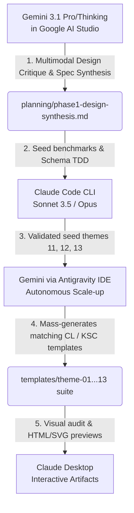

# Master Agentic Workflow: Comprehensive Multi-Agent Integration Guide & Prompting Suite

This document serves as your single consolidated master resource for **TASK-005 (Theme Standardisation)**. It defines the complete multi-agent division of labor, explicit tool configurations, advanced settings (thinking levels, effort, MCP tools), and contains copy-paste ready master prompts to execute the entire theme and document synthesis pipeline.

---

## 🏛️ Section 1: The Triad Division of Labor & Executive Placement

To achieve a production-ready, visually stunning, and ATS-safe document suite (Resumes, Cover Letters, and KSC templates matching themes 01–13) without exhausting context limits or token budget, the work is strictly segregated by agent capability:



### 1. Where to Run the Prompts & Why

*   **Gemini 3.1 Pro / Advanced (Thinking) [Google AI Studio / API]:**
    *   *Task:* Multimodal Design Critique & Concept Synthesis (Phase 1).
    *   *Why:* Ingesting 8 separate resume PDF designs demands native visual/multimodal eyes. Gemini’s **2M token context window** allows it to hold all PDFs, the entire codebase schema (`MASTER_SCHEMA_V2_3.json`), and the existing 10 themes simultaneously without context fatigue.
*   **Claude Code CLI [Local Terminal]:**
    *   *Task:* Seed TDD Theme Implementation (Phase 2).
    *   *Why:* Claude Code operates in a terminal-bound, high-speed loop. It has local tool access to immediately run tests (`validate_template_spec.py`) and correct files. Tasks requiring precise coding to a strict schema are best completed here.
*   **Gemini Agent [Antigravity IDE]:**
    *   *Task:* Autonomous Theme Scale-up & Synchronization (Phase 3).
    *   *Why:* Scaling matching Cover Letters and KSCs across all 13 themes is a high-volume, highly repetitive task. Gemini can swallow the whole workspace and automate file creation at zero cost, freeing Claude from token-heavy repetition.
*   **Claude Desktop [Web Chat]:**
    *   *Task:* Interactive Visual Audits (Phase 4).
    *   *Why:* Claude Desktop's **Artifacts rendering engine** is unmatched for visual feedback. It can render HTML/SVG previews of the entire document suite side-by-side.

---

## 🛠️ Section 2: Strategic Tool & Configuration Matrix

This matrix establishes precisely when to invoke specific tools and how to configure them for maximum quality and cost efficiency.

### 1. Claude Code CLI Advanced Settings

When invoking Claude Code, use the following configuration settings tailored to the task complexity:

| Complexity Profile | CLI Settings & Flag Allocations | Recommended Tasks | Rationale |
|---|---|---|---|
| **Medium / High** | `claude -t high` or default | Standard day-to-day coding loop, minor refactors, and simple scripts. | Minimizes execution cost while maintaining fast response times and high code quality. |
| **X-High** | `claude -t xhigh` <br/>*or* `--thinking-level=xhigh` | Tricky, mathematically intense, or highly constrained bugs (e.g., the `updateTextStyle` ordering bug in `build_golden_master.py`). | Forces Sonnet to spend substantial compute cycles reasoning on a single block of code before outputting. |
| **Ultracode / Workflows** | `claude --model opus` <br/>*or* `claude --workflow` | Large-scale structural changes, major schema upgrades, and multi-file orchestrations. | Parallelizes validations, enforces rigorous task separation, and keeps the main chat context clean. |

---

### 2. Antigravity IDE (Gemini Agent) MCP Tool Matrix

Use the following mapping to choose the correct autonomous MCP tools within the Antigravity IDE:

```
                    Is the task investigatory or active execution?
                                  │
                 ┌────────────────┴────────────────┐
                 ▼                                 ▼
           Investigatory                        Execution
                 │                                 │
         ┌───────┴───────┐                 ┌───────┴───────┐
         ▼               ▼                 ▼               ▼
   [deep-research] [sequential-thinking]  [deep-plan]  [deep-implement]
   Wide folder      Deep logic / step     TDD prep &   Strict checklist
   analysis &       by step evaluation    schema-first execution matching
   mapping          avoiding shortcuts    architecture  tasks.md
```

*   **`deep-plan`:** Invoke when making major architectural changes (e.g., restructuring the relationship between Cover Letters and Resume themes). It prepares a strict implementation plan, analyzes risks, and creates TDD test stubs.
*   **`deep-implement`:** Invoke when executing the step-by-step list in `tasks.md`. It tracks state, keeps code updates minimal, and runs continuous verification.
*   **`deep-project` / `deep-research`:** Invoke for initial directory-wide audits, mapping requirements across directories, or researching cross-source references (e.g., comparing old `archive/` formats to new schema layouts).
*   **`sequential thinking mcp` (Sequential Thinking):** Always use first for complex, logically constrained problems. It prevents the agent from rushing to a shallow solution by forcing it to write out its cognitive steps (conjectures, constraints, and revisions) in a separate thought stream.
*   **`superpowers`:** Use for direct workspace optimization and terminal-driven automation steps.

---

## 📋 Section 3: Current Status & Gap Resolution Roadmap

### 1. TASK-005 Gap Audit

A comprehensive review of the active workspace reveals the following blockers and missing elements:

*   **🔴 Critical Gap: Phase 1 Output is Missing**
    *   The spec `planning/theme-extraction-spec.md` is complete, but `planning/phase1-design-synthesis.md` (the actual text design specifications for the 3 new Pastel Contemporary themes) does not exist.
*   **🔴 Critical Gap: Phase 2 JSONs are Missing**
    *   `templates/theme-11-gentle-authority.json`, `theme-12-contemporary-lilac.json`, and `theme-13-warm-minimal.json` are unwritten.
*   **🔴 Track A Blocker (Builder Fix):**
    *   `tools/build_golden_master.py` has been patched with the `updateTextStyle` ordering fix, but it needs verification against a live Google Doc using `tools/audit_doc_style.py`.

### 2. Consolidated Execution Path

```
                      [STEP 1: Run Design Critique]
                      Generate text specifications using
                      multimodal Gemini (AI Studio).
                                    │
                                    ▼
                     [STEP 2: Run Seed TDD Build]
                      Use Claude Code (xhigh/Sonnet) to
                      compile validated JSON theme files.
                                    │
                                    ▼
                    [STEP 3: Run Document Scale-Up]
                      Use Gemini Agent (Antigravity) to
                      batch-generate CL & KSC templates.
                                    │
                                    ▼
                    [STEP 4: Run Style Verification]
                      Run audit_doc_style.py on a live
                      Google Doc to unblock Track A.
                                    │
                                    ▼
                    [STEP 5: Run Visual Gallery Audit]
                      Generate interactive preview HTMLs
                      using Claude Desktop Artifacts.
```

---

## ✍️ Section 4: The Polished Master Prompts Suite

Below are the optimized, highly structured master prompts for each stage of the project.

---

### Prompt A: Multimodal Design Critique & Concept Synthesis
*   **Execute In:** Gemini 3.1 Pro / Advanced (Thinking) in **Google AI Studio** or API.
*   **Inputs:** Upload the 8 template PDFs + paste this prompt.

```xml
<design_critique_prompt>
<system_context>
You are an elite typographer and visual designer. You are evaluating 8 external resume template PDFs to extract their design grammar and synthesize them into 3 distinct, production-ready ATS-safe "Pastel Contemporary" theme specifications for the "Career Brain" pipeline.
</system_context>

<constraints>
- Hard ATS Safety: Single-column only, no tables, no floating text boxes, no headers/footers, no graphic icons/emojis.
- Fonts: Arial, Calibri, or Georgia only (whitelisted Google Docs fonts).
- Base Size: 10.5pt.
- Line Spacing: 1.22 to 1.28.
- Color: High-contrast body text (#1F1F1F or darker). Pastels must only be used as micro-accents or background tints behind high-contrast text.
</constraints>

<critique_skill_chain>
1. **Analyze (Reasoning):** Inspect each of the 8 uploaded PDFs. Critique their layout grids, spacing, typographical hierarchies, and identify which elements violate ATS safety.
2. **Score:** Evaluate each template on clarity, distinctiveness, accessibility, and ATS-compatibility.
3. **Synthesize:** Extract the strongest features and combine them into 3 cohesive, visually distinct "Pastel Contemporary" concepts. They must differ from existing themes 01-10 on at least 3 dimensions (band placement, divider grammar, header silhouette, palette mood, or accent logic).
</critique_skill_chain>

<output_format>
Write your complete response to a markdown file format. You must cover these sections for each of the 3 synthesized concepts:
- **Concept Name & Visual Identity:** Silhouette, density target, motif name, and mood.
- **Palette:** Precise 6-digit uppercase hex codes only (e.g., #EBF8FF, #2B6CB0). No shorthand. Explicitly assign: base_colours, complementary_accent, neutral_surface, neutral_text, neutral_background, and supporting_neutral.
- **Typography:** Exact base font family, font size, line spacing, heading weights, and heading sizes.
- **Layout & Rhythm:** Margins (in inches), band strategy (height in pt, intensity, and location), and divider grammar (solid, dashed, editorial-mix, etc.).
- **Accent Logic:** Strict rules for where color is allowed vs. forbidden.
- **Anti-Generic Rules:** Guardrails to prevent the design from falling back to boring templates.
- **Source Attribution:** List which of the 8 PDFs contributed which elements to this concept.
</output_format>

<directive>
Execute the critique skill chain in full. Write the resulting 3 design specifications into a single, cohesive, production-ready markdown file.
</directive>
</design_critique_prompt>
```

---

### Prompt B: Claude Code CLI Seed TDD Implementation
*   **Execute In:** Local Terminal using **Claude Code**.
*   **CLI Invocation Syntax:**  
    `claude --model sonnet --thinking-level xhigh`
*   **Inputs:** Paste this prompt once the session starts.

```xml
<claude_code_tdd_prompt>
<system_context>
You are an expert software engineer running inside the Claude Code CLI with advanced thinking enabled (--thinking-level=xhigh). You are executing Phase 2 of the Career Brain Theme Standardisation plan.
</system_context>

<objective>
Translate the newly synthesized text specifications in `planning/phase1-design-synthesis.md` into 3 production-ready, schema-validated JSON files inside `templates/`.
</objective>

<execution_instructions>
1. Read `planning/phase1-design-synthesis.md`.
2. Read the master schema at `templates/MASTER_SCHEMA_V2_3.json`.
3. Read an existing theme (e.g., `templates/theme-01-graphite-ledger.json`) to understand correct formatting and key layout.
4. Write the 3 JSON files:
   - `templates/theme-11-gentle-authority.json`
   - `templates/theme-12-contemporary-lilac.json`
   - `templates/theme-13-warm-minimal.json`
5. Run the schema validator:
   `python3 tools/validate_template_spec.py templates/theme-11-gentle-authority.json`
   `python3 tools/validate_template_spec.py templates/theme-12-contemporary-lilac.json`
   `python3 tools/validate_template_spec.py templates/theme-13-warm-minimal.json`
6. Correct all hex codes to be 6-digit uppercase. Ensure 100% compliance with ATS rules (single-column, correct font whitelist).
7. Create a `tasks.md` file in the root directory to track your checklist and log all verification outcomes.
</execution_instructions>

<verification_criteria>
- No parsing errors from `validate_template_spec.py`.
- No two themes share the same band_placement + divider_rhythm.
- All hex codes are uppercase and fully expanded (e.g., #4A5568).
</verification_criteria>
</claude_code_tdd_prompt>
```

---

### Prompt C: Gemini Autonomous Theme Scale-up & Synchronization
*   **Execute In:** Gemini Agent via the **Antigravity IDE** planning mode.
*   **Inputs:** Paste this prompt into the Antigravity session.

```xml
<antigravity_scaleup_prompt>
<system_context>
You are the Gemini Agent operating autonomously inside the Antigravity IDE workspace. You are executing Phase 3 of the Theme Standardisation plan using your deep codebase search and batch-generation capabilities.
</system_context>

<objective>
Using the 3 new validated JSON seed themes (11, 12, 13) as a design benchmark, scale the theme architecture so that every Resume theme has a perfectly matching Cover Letter and KSC template inside the `templates/` directory.
</objective>

<actions>
1. Read the new theme JSON files (`templates/theme-11-*.json`, `theme-12-*.json`, `theme-13-*.json`).
2. Read the base templates: `templates/cover_letter_base_v1.json` and `templates/ksc_base_v1.json`.
3. For every theme from 01 through 13:
   - Generate a matching Cover Letter template (e.g., `templates/cover_letter_theme_01_graphite_ledger.json`).
   - Generate a matching KSC template (e.g., `templates/ksc_theme_01_graphite_ledger.json`).
   - Deep-copy the exact color palette, primary/secondary accents, fonts, margins, line spacing, and divider/border logic from the resume theme into the respective Cover Letter and KSC files.
4. Verify that all 39 templates (13 Resumes + 13 Cover Letters + 13 KSCs) are perfectly aligned, fully populated, and syntactically correct.
5. Generate a comprehensive validation report at `planning/QUALITY_SUMMARY.md` tracking the complete suite.
</actions>

<karpathy_rules>
- Smallest change that solves the problem.
- Maintain complete source lineage.
- Zero placeholder strings.
</karpathy_rules>
</antigravity_scaleup_prompt>
```

---

### Prompt D: Claude Desktop Visual Preview Rendering
*   **Execute In:** **Claude Desktop** (Web Chat).
*   **Inputs:** Attach the v2.3 theme JSONs + paste this prompt.

```xml
<claude_desktop_preview_prompt>
<system_context>
You are an expert frontend engineer and UI/UX designer. You are evaluating the complete Career Brain document theme suite (Resumes, Cover Letters, and KSCs).
</system_context>

<objective>
Render a side-by-side, high-fidelity visual gallery of the document suite for the user's final aesthetic review and sign-off.
</objective>

<action>
1. Parse the attached JSON theme files.
2. Render an interactive, beautifully structured HTML/CSS preview dashboard as a Claude Artifact.
3. The dashboard must show:
   - A side-by-side comparison of a Resume, Cover Letter, and KSC response.
   - Live color palette chips showing exact contrast ratios.
   - Interactive toggles to switch between Theme 11 (Gentle Authority), Theme 12 (Contemporary Lilac), and Theme 13 (Warm Minimal).
4. Use standard, high-quality Tailwind CSS or modern vanilla CSS to make the layouts look exactly like printed A4 documents.
</action>

<output_instructions>
Create a single, self-contained HTML/CSS file containing the dashboard and render it directly inside an interactive Claude Artifact.
</output_instructions>
</claude_desktop_preview_prompt>
```
