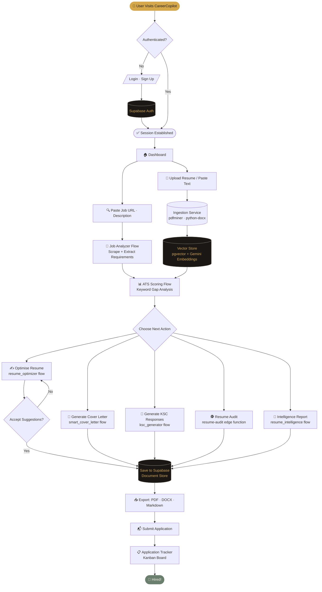
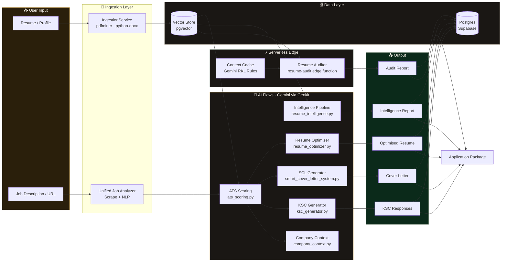

# CareerCopilot – Workflow Diagrams

> Generated by `scripts/generate_workflow_diagram.py`.
> Render with any Mermaid-compatible viewer (GitHub, mermaid.live, VS Code extension).

---

## 1. User Journey

End-to-end flow from landing on the app through to submitting a job application.

---

## 2. AI Flow Architecture

How the Genkit AI flows connect inputs, vector storage, and generated outputs.

---

## Key Components

| Component | File | Responsibility |
|---|---|---|
| Ingestion Service | `backend/app/services/ingestion_service.py` | Parse PDF/DOCX resumes |
| Job Analyzer | `ai/flows/backend/unified_job_analyzer.py` | Scrape & extract job requirements |
| ATS Scoring | `ai/flows/backend/ats_scoring.py` | Score resume against job description |
| Resume Intelligence | `ai/flows/backend/resume_intelligence_pipeline.py` | Deep career insights & progression |
| Resume Auditor | `supabase/functions/resume-audit/` | Australian rule-based auditing |
| Resume Optimizer | `ai/flows/backend/resume_optimizer.py` | Suggest keyword improvements |
| Smart Cover Letter | `ai/flows/backend/smart_cover_letter_system.py` | Draft tailored cover letters |
| KSC Generator | `ai/flows/backend/ksc_generator.py` | Draft STAR-format KSC responses |
| Company Context | `ai/flows/backend/company_context.py` | Research company background |
| Vector Store | `backend/app/services/vector_store.py` | Semantic search (pgvector) |
| Application Tracker | `frontend/src/features/applications/` | Kanban board for job tracking |
